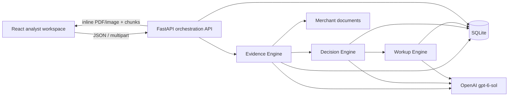
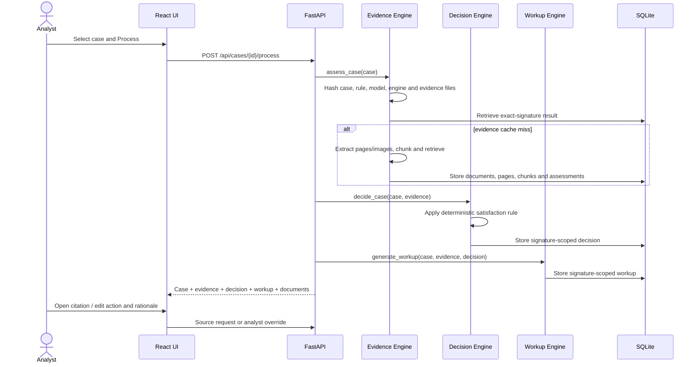

# Architecture and design decisions

## System boundary

The three supplied engines remain separate modules. FastAPI coordinates them rather than duplicating their logic. This keeps evidence interpretation, deterministic decision policy, and analyst-facing writing independently testable.

## Case processing sequence

## Why the UI is queue-first

An analyst working roughly 80 cases per day needs to answer four questions quickly:

1. What is the allegation and applicable defense standard?
2. Which requirements are satisfied, partial or missing?
3. Where can I verify each claimed fact?
4. What should I file or ask the merchant for?

The left queue keeps merchant, amount, scheme/code, document count and current action visible. The center column follows the analyst's decision sequence: issuer allegation, reason-code standard, transaction facts, evidence matrix, then editable decision. The right source inspector remains visible while the analyst reads the matrix. Clicking a citation selects the original file, PDF page, validated excerpt and exact extracted chunk.

The system recommendation is deliberately editable. The override stores the action, edited rationale, analyst note and timestamp separately from engine output, preserving both machine recommendation and human accountability.

## Persistence and cache validity

SQLite contains loaded cases, document/page/chunk extraction, requirement assessments, decisions, workups and analyst overrides. Evidence cache reuse requires both `case_id` and a signature covering:

- the complete current case;
- the applicable reason-code rule;
- checksums of every currently referenced evidence file;
- the model; and
- the engine version.

This permits fast repeat review while detecting a replaced, added or removed merchant document. Removed document records cascade to their pages and chunks on the next cache miss.

## Manual intake

The Add Case dialog exposes the raw transaction fields used by the engines and accepts PDF, PNG, JPG and WebP evidence. The API normalizes uploaded names under the case ID, limits individual files to 20 MB, stores the case in the same local queue and invalidates any older result for that case ID.

## Scope and limitations

- The API is intentionally synchronous because this case study has ten small cases. Production should use a durable job queue and expose progress events.
- SQLite is appropriate for a single analyst demo. A multi-user service should use a managed relational database and object storage.
- Authentication, authorization, malware scanning and scheme-rule update operations are outside this assignment.
- The Vite server is used for simple local execution. Production should serve the built frontend behind the application gateway.
