# Representment Desk — System Architecture

## 1. What the system does

Representment Desk turns a raw chargeback case and its merchant evidence into an analyst-ready workup. It separates the work into three stages so that evidence interpretation, scheme-rule execution and analyst writing can be inspected independently.

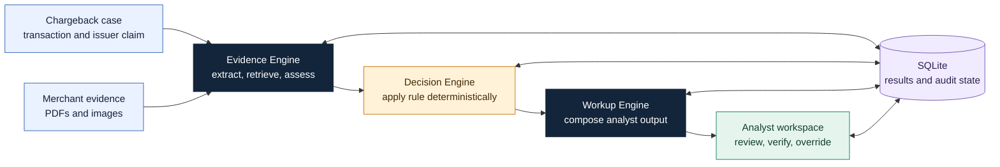

The Evidence Engine answers **what the submission proves**. The Decision Engine answers **what action the rule permits**. The Workup Engine answers **how the conclusion should be presented to an analyst**. The React interface keeps the human analyst in control of the final filed decision.

## 2. System topology

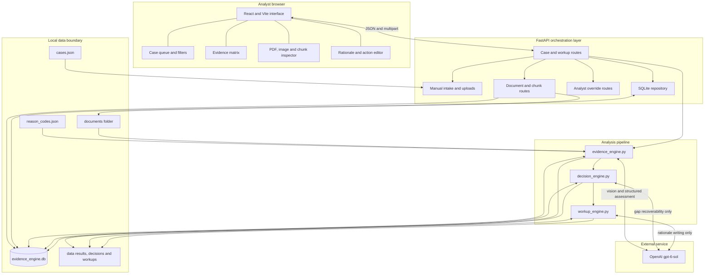

### Component responsibilities

| Component | Owns | Does not own |
|---|---|---|
| React interface | Queue navigation, evidence verification, manual intake, analyst edits and overrides | Scheme-rule execution or evidence interpretation |
| FastAPI | HTTP contracts, uploads, orchestration and response assembly | Duplicated decision logic |
| Evidence Engine | Extraction, chunking, retrieval, requirement assessment and citations | Final represent/accept decision |
| Decision Engine | Satisfaction threshold, recommended action and recoverable-gap analysis | Re-reading source documents |
| Workup Engine | Reason summary, evidence checklist, rationale and merchant request presentation | Changing the deterministic recommendation |
| SQLite | Persistent extraction, results, loaded cases and analyst overrides | Original evidence binaries |
| Documents folder | Original PDF and image evidence | Derived assessment state |

This division reduces hidden coupling. A reviewer can inspect a citation without trusting the decision layer, and can inspect the decision rule without asking the model to reproduce document extraction.

## 3. End-to-end analyst flow

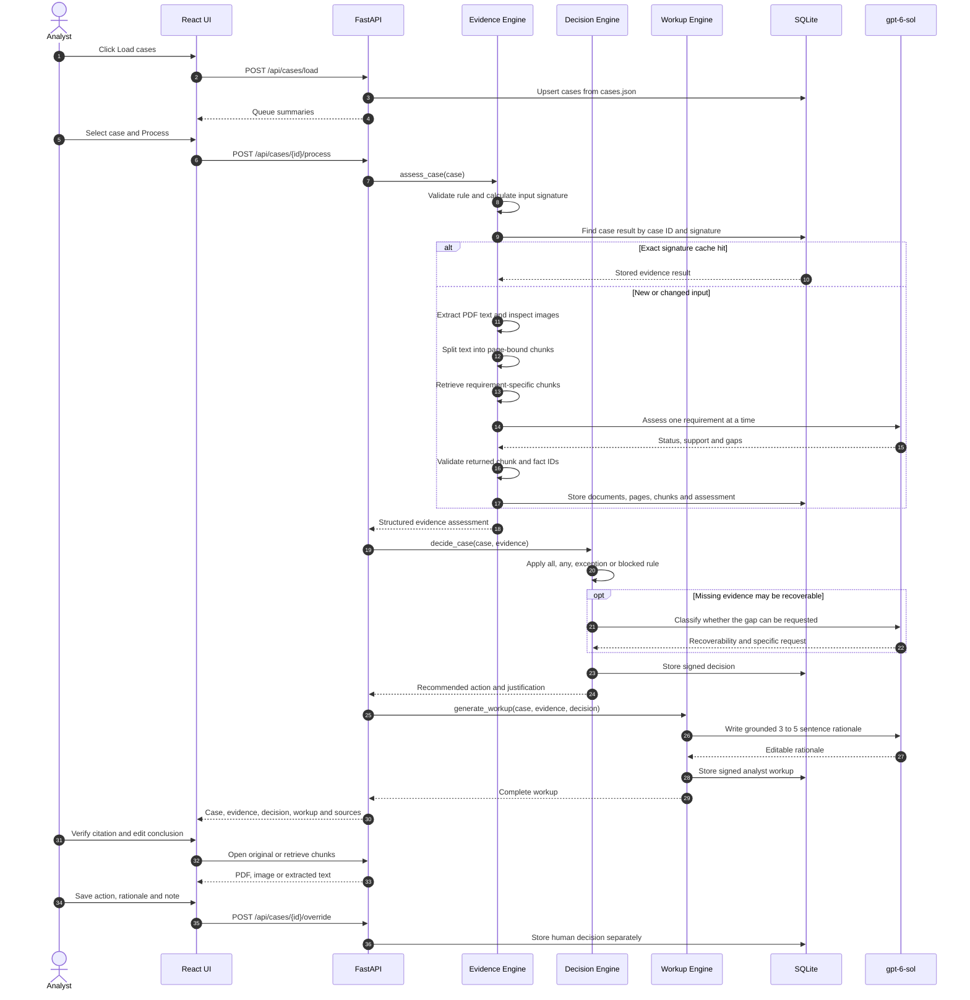

### Why the engines run in this order

1. **Evidence comes first.** A decision should be based on validated facts and source pointers, not on an unconstrained reading of the entire submission.
2. **The rule is applied after evidence classification.** This makes the final action reproducible from requirement statuses and the reason-code threshold.
3. **The rationale is written last.** The writing model receives structured findings and a fixed recommendation, reducing the chance that persuasive wording changes the actual decision.
4. **The analyst reviews the combined workup.** Automation reduces document handling and drafting time while preserving human accountability for the filed response.

## 4. Evidence processing and citation integrity

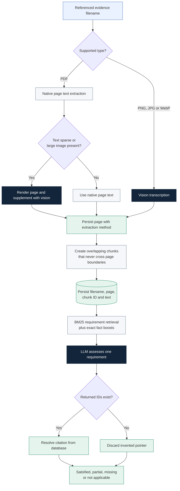

The model never supplies an authoritative filename or page number. It may select only chunk IDs and case-fact keys that were included in its prompt. The engine resolves those identifiers back to database records and silently drops unknown IDs. This makes every displayed citation traceable to a stored source.

### Retrieval choice

The current evidence script uses BM25 with exact transaction-field boosts. That choice is appropriate for the small case-local corpus because chargeback evidence often turns on exact values such as tracking numbers, dates, postcodes, transaction IDs and authorization codes. Requirement-specific retrieval also prevents unrelated pages from consuming the assessment context.

The tradeoff is weaker semantic matching for heavily paraphrased evidence. A production extension could add BGE Large embeddings and combine semantic and lexical scores while retaining the same chunk IDs and citation validation boundary.

## 5. Decision policy

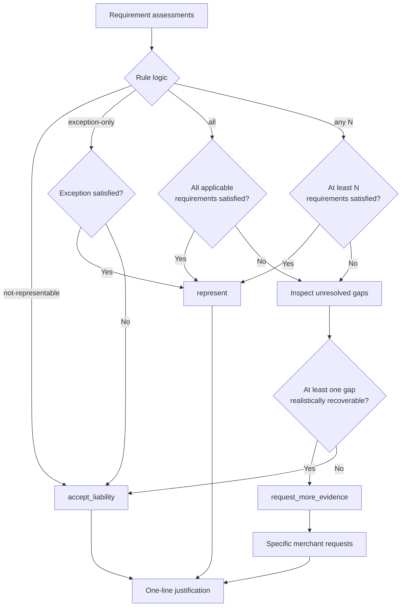

The LLM does not choose between represent and accept liability. The Decision Engine applies the structured `satisfaction-criteria` from `reason_codes.json`. AI is used only after the rule is not met, to determine whether a missing item can realistically be supplied by the merchant. For example, an existing signed delivery record may be requestable, while retroactively performing 3-D Secure is not.

This hybrid design combines consistent policy execution with useful interpretation of ambiguous evidence gaps.

## 6. Cache validation and change detection

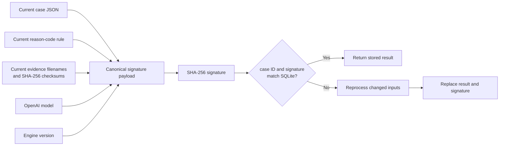

Using only `case_id` would be unsafe because a merchant could upload new evidence under an existing case. The signature is calculated from the current files before a cached result is accepted. Therefore:

- a changed case narrative invalidates the cache;
- a changed rule invalidates the cache;
- an added, removed or replaced document invalidates the cache;
- a model or engine-version change invalidates the cache; and
- an unchanged case returns quickly without repeating extraction or LLM calls.

The Evidence, Decision and Workup Engines have separate signatures. A presentation-layer change can regenerate the workup while retaining valid evidence extraction and deterministic decision results.

## 7. Persistent data model

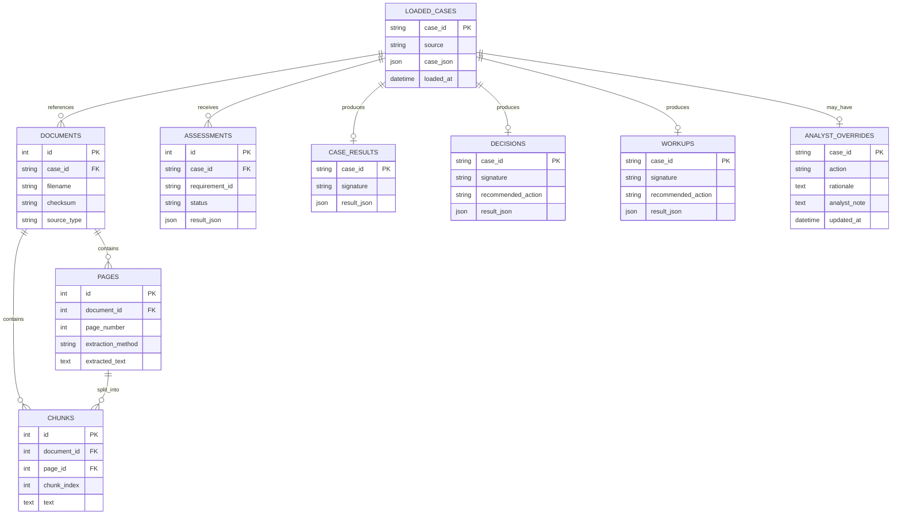

Original documents stay in the `documents` folder. SQLite stores their hashes and derived searchable content. Keeping original and derived data separate lets the interface show both the source file and the exact text used during assessment.

## 8. Interface architecture

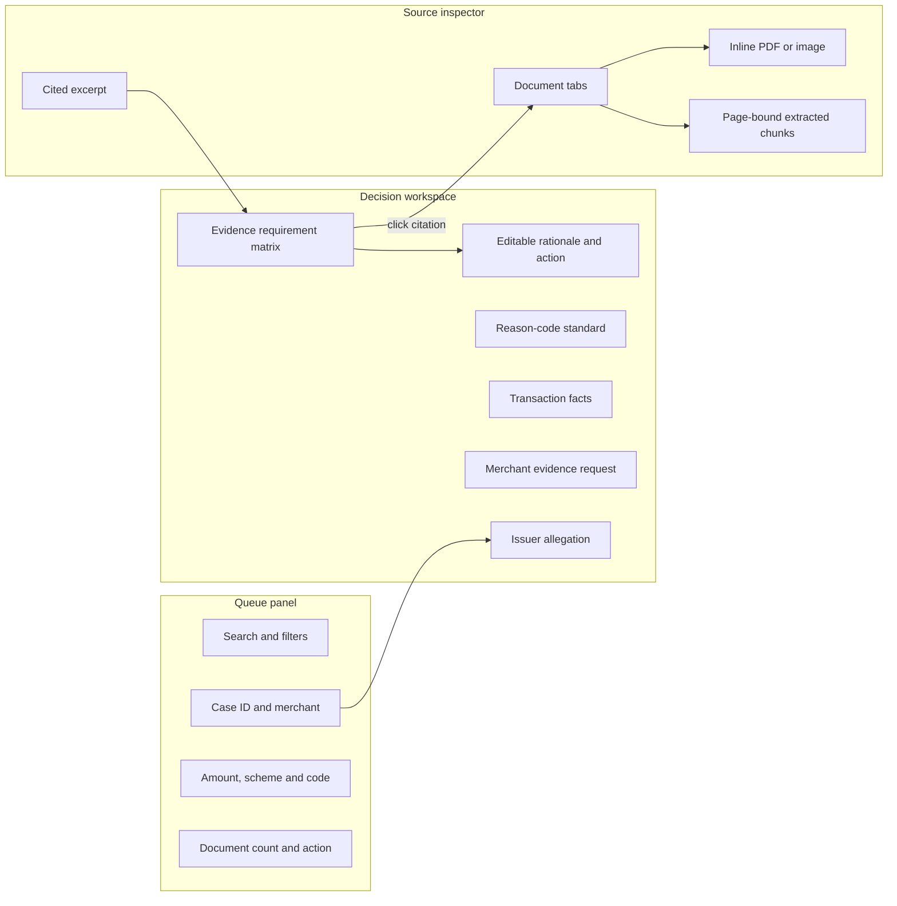

### Why a three-column layout

The layout keeps the analyst's three working contexts visible at once:

- **Queue context:** what case is next and how urgent or complete it appears.
- **Decision context:** what the rule requires and which requirements are met.
- **Verification context:** where the supporting fact appears in the original submission.

Opening evidence in a separate screen would create repeated context switching. A persistent source inspector lets the analyst verify a citation while keeping the requirement and proposed rationale visible.

### Information hierarchy

| UI decision | Reason |
|---|---|
| Issuer allegation appears first | It frames the actual dispute before the analyst reads merchant evidence. |
| Reason-code standard precedes the evidence matrix | The analyst sees what must be proven before judging individual documents. |
| Status uses text, color and icon | The interface remains readable without relying only on color. |
| Gaps appear directly under the affected requirement | The analyst does not need to infer why a requirement is partial or missing. |
| Citations sit inside each requirement row | Source provenance stays attached to the claim it supports. |
| Merchant requests are highlighted above the editor | A `request_more_evidence` case immediately tells the analyst what to ask for. |
| Rationale and action are editable | The analyst owns the filed response and can correct context the system missed. |
| Override note is stored separately | Human changes remain explainable during review or quality assurance. |

### Supporting an 80-case day

The interface minimizes repeated navigation and writing:

1. Load the fixture queue once.
2. Search or filter without leaving the queue.
3. Read the recommendation and coverage count immediately.
4. Expand verification only when a fact needs confirmation.
5. Edit an already-grounded rationale rather than drafting from scratch.
6. Save an override without destroying the original machine recommendation.

## 9. Manual case intake

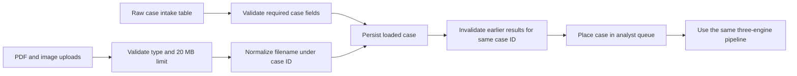

Manual cases do not use a separate analysis path. They are normalized into the same case shape and then processed by the same engines, cache rules and analyst interface. This prevents the demo-data workflow and real intake workflow from drifting apart.

## 10. API surface

| Method and route | Role in the workflow |
|---|---|
| `POST /api/cases/load` | Import the supplied `cases.json` records into the local queue. |
| `GET /api/cases` | Return compact queue summaries and processing state. |
| `GET /api/cases/{id}` | Return the raw case, engine outputs, document summary and human override. |
| `POST /api/cases/{id}/process` | Run or retrieve the complete three-engine workup. |
| `GET /api/cases/{id}/chunks` | Return extracted chunks for a selected case document. |
| `GET /api/cases/{id}/documents/{filename}` | Stream an authorized case document inline. |
| `POST /api/cases/{id}/override` | Persist the analyst's final action, rationale and note. |
| `POST /api/cases/manual` | Create a raw case and upload its evidence. |

The frontend consumes a single case bundle rather than making separate calls for every engine result. This makes case switching predictable. Original documents and chunks remain separate endpoints because they can be larger and are needed only when the analyst verifies a source.

## 11. Reliability and trust boundaries

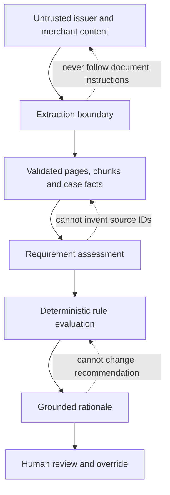

The system treats document content as data, not instructions. Structured model outputs are constrained by schemas, and evidence pointers are resolved against known database identifiers. The rationale model cannot change the Decision Engine's recommendation. The final human override is stored separately so that the original automated result remains available.

## 12. Key architectural tradeoffs

| Decision | Why it fits this case study | Production evolution |
|---|---|---|
| React plus FastAPI | Clear separation between analyst experience and Python engines. | Serve the built frontend behind an API gateway. |
| SQLite | Simple persistence with no external service for a ten-case local demo. | Move to PostgreSQL for concurrent analysts and stronger migrations. |
| Local documents folder | Easy source inspection and checksum validation. | Move to encrypted object storage with signed URLs and malware scanning. |
| Synchronous processing endpoint | Simple end-to-end execution and clear demo behavior. | Use a job queue, idempotency keys and progress events for long-running cases. |
| Deterministic decision engine | Reproducible recommendations and easier audit. | Add versioned policy deployment and formal rule tests. |
| LLM per requirement | Focused prompts and requirement-level citations. | Batch safe operations where latency and cost measurements justify it. |
| Separate machine result and analyst override | Preserves accountability and supports quality review. | Add roles, approvals, immutable audit events and reason taxonomies. |

## 13. Operational flow

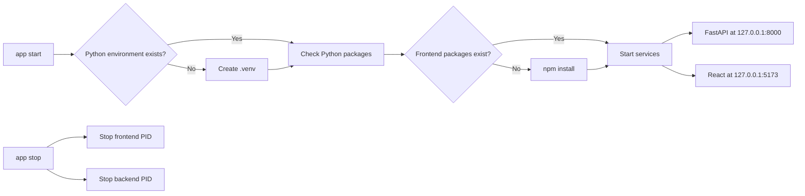

Windows uses `app.cmd` and `app.ps1`; Linux uses `app`. Both launchers maintain separate backend and frontend PID files and logs under `.runtime`, allowing `start`, `stop`, `status` and `restart` without requiring the analyst to manage two terminals.

## 14. Practical evaluation criteria

The architecture should be evaluated on more than whether it produces a plausible recommendation:

- **Traceability:** Can every material claim be opened at its source?
- **Rule fidelity:** Does the action follow the configured satisfaction threshold?
- **Change sensitivity:** Does new evidence invalidate stale analysis?
- **Analyst efficiency:** Can the analyst reach the relevant page or chunk in one click?
- **Human control:** Can the analyst edit and override without losing the automated recommendation?
- **Reproducibility:** Can the same unchanged case reuse the same stored result?
- **Separation of concerns:** Can extraction, policy and writing be reviewed independently?

These criteria guided both the system boundaries and the interface hierarchy.
